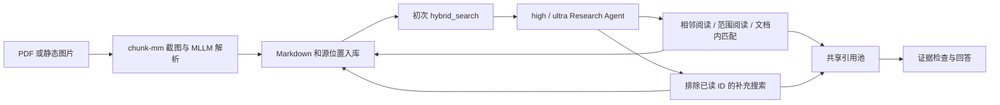

# chunk-mm：基于 MLLM 正文的 Agentic Search

本功能让 RAGFlow 在初次检索之后，继续读取原文相邻块、查找文档内关键词、按范围阅读，并排除已经看过的片段寻找补充证据。它直接使用 `chunk-mm` 多模态解析入库的 Markdown，复用现有知识库、检索引擎和引用系统。

实现位于 `chunk-mm` 分支，开发基线为 `9db1d92`。这是对 RAGFlow 原生 Agentic RAG harness 的增强：采用了检索与文档阅读交替进行的方案，没有引入 Mistral SDK、Mistral API、Vespa 或新的服务依赖。与 Mistral Agentic Search 的联系是设计思路，不是官方适配器或功能完全等价的实现。

## 目录

- [解决什么问题](#解决什么问题)
- [数据链路与代码位置](#数据链路与代码位置)
- [准备和启用](#准备和启用)
- [工具与参数](#工具与参数)
- [调用示例](#调用示例)
- [返回结果与引用](#返回结果与引用)
- [性能、范围和限制](#性能范围和限制)
- [测试与真实服务验收](#测试与真实服务验收)
- [故障排查](#故障排查)
- [部署与回退](#部署与回退)

## 解决什么问题

例如，一份设备手册在某个块中写“工作温度上限 40℃”，下一个块才写低负载模式下的例外。普通 top-k 检索可能只召回上限，遗漏适用条件。

原有 inspector 在已经召回的结果列表里寻找“邻居”。这个列表按相关度排列，可能混有不同文档，不能代表原文顺序。本次改动先确定锚点所属文档，再按源位置读取真实相邻块，能够取得初次检索未召回的例外条款。

| 能力 | 本次行为 |
|---|---|
| 原文上下文 | 从索引读取同一文档前后完整块，而非搜索排名相邻结果 |
| 文档内匹配 | 在已入库正文中匹配，不局限于此前召回的文本 |
| 分段阅读 | 以可见正文块序号读取一个范围 |
| 补充检索 | 排除已读 chunk ID，在有界候选中继续寻找证据 |
| 引用衔接 | 新证据加入共享引用池，重读完整源文可恢复被关键词裁剪的正文 |
| 模型可用性 | 修正工具注册名，向模型展示导航 ID、引用编号和更多正文 |

该功能增加获取证据的手段，不保证每个问题都会触发导航，也不保证 MLLM 转录的表格数值正确。

## 数据链路与代码位置



| 文件 | 职责 |
|---|---|
| [chunk_multimodal.py](rag/svr/chunk_multimodal.py) | 现有截图到 Markdown 的解析、归档复用；本次未修改 |
| [agentic_rag.py](rag/advanced_rag/agentic_rag.py) | `RAGTools.iter_document_chunks`，校验范围并分页读取正文 |
| [inspector.py](rag/advanced_rag/harness/tools/inspector.py) | 原文导航与文档内匹配 |
| [search.py](rag/advanced_rag/harness/tools/search.py) | 范围校验、排除已读结果、候选补充与缓存 |
| [registry.py](rag/advanced_rag/harness/tools/registry.py)、[工具注册](rag/advanced_rag/harness/tools/__init__.py) | 模型工具名称、参数定义和执行函数 |
| [config.py](rag/advanced_rag/harness/config.py)、[gating.py](rag/advanced_rag/harness/tools/gating.py) | 思考模式及阶段可用工具 |
| [pipeline.py](rag/advanced_rag/harness/pipeline.py) | 调度、错误归一化、trace 和引用池更新 |
| [agent.py](rag/advanced_rag/harness/agent.py) | 模型工具调用、结果展示和引用编号处理 |
| [agentic_search_api_service.py](api/apps/services/agentic_search_api_service.py) | 校验 API 参数、授权知识库/会话、创建请求级对话副本并调用 `rag_agent` |
| [agentic_search_api.py](api/apps/restful_apis/agentic_search_api.py) | 9380 上的 Bearer 鉴权和 `/api/v1/agentic-search` 路由 |
| [PowerShell 测试脚本](scripts/test_agentic_search.ps1)、[Bash 测试脚本](scripts/test_agentic_search.sh) | 参数化在线调用及 JSONL 输入输出日志 |

导航读取现有 `content_with_weight`，不重新调用视觉模型，不重新计算 embedding，也不读取截图归档作为另一个检索库。数据库字段未新增；9380 后端提供独立的 Agentic Search HTTP API。

## 准备和启用

### 1. 完成多模态入库

按[多模态解析文档](docs/chunk-multimodal-parser.md)配置视觉模型，或使用[异步解析 API](docs/chunk-multimodal-api.md)提交解析任务。等待任务完成并确认文档已可检索；HTTP 202 只表示任务已接受，不表示已经完成入库。

- PDF 仍依赖前面的 DeepDOC 解析和截图步骤。
- 静态图片采用 Picture 路径；能否使用文档顺序导航还取决于索引是否提供源位置。
- `chunk-mm` 多模态解析禁止父子分块；异步 API 的配置构建也会关闭父子切分。
- 对已正确入库且具有源位置的 Markdown，无需因为这次查询侧改动重新解析。

### 2. 绑定知识库和问答模型

在现有对话配置中绑定对应知识库。MLLM 负责解析图片，问答模型负责规划搜索、调用工具和组织回答，二者可以是不同模型。

问答模型支持原生工具调用时走原生调用路径；否则沿用当前基于文本的工具选择路径。模型能力、上下文长度和循环预算都会影响是否能完成多步阅读。

### 3. 启用 high 或 ultra

[现有对话服务](api/db/services/dialog_service.py)把调用参数 `reasoning` 的数字值映射为：

| 传给现有对话链路的 reasoning | 内部模式 | 行为 |
|---|---|---|
| `1` | `low` | 直接检索 |
| `2` | `medium` | 分解问题并检索 |
| `3` | `high` | Agent 研究，允许文档导航 |
| `4` | `ultra` | 更深入的研究编排，允许文档导航 |

这些是现有对话链路的参数映射；新增端点复用同一映射并默认传 `3`。其他旧接口无效或未传入模式值时可能回到 `medium`；不要把仅打开“推理”开关等同于明确选择 `high`。

嵌入后端代码时，可在构造 `RAGTools` 时传入 `thinking_mode="high"` 或 `"ultra"`。门控以实际引用池判断是否已有证据，并向模型提供初始证据的 ID 与内容。由于原生工具定义在一次模型调用期间固定，locate 阶段也绑定导航工具，允许模型先搜索再读取；执行导航时仍须提供真实 ID。explore 阶段支持范围读取和相邻阅读，verify 阶段优先比较与匹配。模型不保证每轮都调用工具。

## 工具与参数

### hybrid_search

必填 `query`；其余参数可省略。

| 参数 | 默认 | 说明 |
|---|---|---|
| `keywords` | 空字符串 | 延续原有关键词扩展和匹配裁剪逻辑 |
| `kb_ids` | 当前绑定 KB | 只能缩小绑定范围；空数组表示不搜索 |
| `doc_scope` | 不额外限制文档 | 限定文档 ID；空数组表示不搜索，未知或越界文档报错 |
| `top_n` | `12` | 期望返回数量，模型 schema 声明范围为 1–100 |
| `exclude_ids` | 空 | 已读字符串 chunk ID；省略/空数组走普通检索路径 |

有排除 ID 时，在父子归一化后的结果上去重并排除，最多调用 4 页。单页大小为 `min(max(2 * top_n, 24), 100)`，因此最多检查 400 条返回候选。少于期望结果可能是没有更多匹配，也可能是候选预算耗尽，应检查返回的 `search_metadata`。

排除集合纳入请求缓存键；不同文档范围、KB 范围和数量不会混用同一缓存。该缓存不是持久缓存，也不能作为索引快照。

### 文档阅读工具

| 工具 | 必填 | 可选默认值 | 返回 |
|---|---|---|---|
| `inspector_open_context` | `chunk_id` | `width=500`，1–20000 | 锚点与前后完整块，每侧最多 20 块 |
| `inspector_request_adjacent` | `chunk_id` | `direction="next"`、`count=3`，1–20 | 同一文档真实前/后邻居，不包含锚点 |
| `inspector_read_document` | `doc_id` | `start=0`，0–9999；`count=5`，1–20 | 范围内正文及 `next_start` |
| `inspector_grep_within` | `doc_id`、`pattern` | `mode="phrase"`、`top_k=5`，1–20 | 匹配的完整源文块 |
| `inspector_compare` | `chunk_ids` | 无 | 返回已收集的多个块供模型比较，不重新读取索引 |

`open_context.width` 是每侧期望覆盖的字符量，保留完整块，所以返回字符数可能超过 width；有邻居时至少包含一个。`start` 是过滤禁用块及辅助记录后的零基正文序号，不是页码或字符偏移。`next_start=start+本次返回块数`，不保证一定存在下一页。

`pattern` 为非空、最长 1000 字符的字符串。`phrase` 做忽略大小写的字面子串匹配；`term` 要求同一块中包含全部空白分隔词。不支持正则、跨块短语、语义匹配或中文分词，匹配结果也不等于严格的语言学“完整词”匹配。

## 调用示例

### 9380 HTTP API

外部进程和 MCP 工具使用以下端点，不需要修改 Chat Assistant 的持久配置：

```http
POST /api/v1/agentic-search
Authorization: Bearer <RAGFLOW_API_KEY>
Content-Type: application/json
```

调用前需要准备：

1. 部署并重启包含本分支代码的 9380 后端。
2. 在 RAGFlow 中创建 Chat Assistant，并绑定已经完成解析的知识库。
3. 创建 RAGFlow API key。调用时使用 `Authorization: Bearer <API key>`，不要把问答模型供应商的 key 传给此接口。
4. 从 RAGFlow 获取 Chat Assistant 的 `chat_id`。如果不传 `dataset_ids` 和 `model`，接口直接使用该 Chat Assistant 保存的配置。

最小请求只需要 `query` 和 `chat_id`：

```bash
curl -sS 'http://127.0.0.1:9380/api/v1/agentic-search' \
  -H "Authorization: Bearer $RAGFLOW_API_KEY" \
  -H 'Content-Type: application/json' \
  --data '{
    "query":"产品支持哪些机械手功能？请给出引用。",
    "chat_id":"1c9dc6468a2511f1b194b520b0860b27"
  }' | jq .
```

需要明确覆盖知识库、模型和研究强度时使用完整请求：

```json
{
  "query": "请比较经典系列和卓越系列面板的机械手功能，并给出引用。",
  "chat_id": "1c9dc6468a2511f1b194b520b0860b27",
  "dataset_ids": ["982c06185fc011f1a9d2a33ecabf0a06"],
  "model": "deepseek-v4-flash@parser@Tongyi-Qianwen",
  "reasoning": 3,
  "top_n": 8,
  "similarity_threshold": 0.2
}
```

请求参数：

| 字段 | 类型 | 必填 | 默认/约束 | 说明 |
|---|---|---|---|---|
| `query` | string | 是 | 去除首尾空白后非空 | 用户问题，也是 Agent 的研究目标 |
| `chat_id` | string | 是 | 必须属于当前 API key 对应租户 | 复用其 prompt、知识库和默认问答模型 |
| `session_id` | string | 否 | 省略时创建新会话 | 继续对话时必须属于同一个 Chat Assistant 和用户 |
| `dataset_ids` | string[] | 否 | 省略时使用 Chat Assistant 已绑定知识库 | 本次请求的知识库覆盖；逐个校验访问权、分块和 embedding 一致性 |
| `model` | string | 否 | 省略时使用 Chat Assistant 模型 | RAGFlow 模型引用，例如 `模型@实例@供应商`；必须已在当前租户注册 |
| `reasoning` | integer | 否 | `1..4`，默认 `3` | `3`/`4` 才启用 Agentic Research 和文档导航 |
| `top_n` | integer | 否 | 正整数 | 本次请求的检索数量覆盖 |
| `similarity_threshold` | number | 否 | `0..1` | 本次请求的相似度阈值覆盖 |

`dataset_ids`、`model`、`top_n` 和 `similarity_threshold` 只应用在深拷贝的对话对象，不写回 Chat Assistant。未知字段直接返回参数错误。

返回的 `data` 字段：

| 字段 | 说明 |
|---|---|
| `request_id` | 单次 API 调用标识；成功和执行异常响应都可用于查日志 |
| `chat_id` / `session_id` | 使用的 Chat Assistant 和持久会话 ID |
| `answer` | Agent 研究后的最终回答 |
| `references` | 扁平引用数组；每项包含 chunk、知识库、文档、正文、相似度、位置、图片和 URL 信息 |
| `reference_count` | `references` 数量 |
| `model` / `reasoning` | 本次实际选择的模型引用与研究等级 |
| `elapsed_ms` | 服务端执行耗时，单位毫秒 |

参数、权限或资源状态问题通过 RAGFlow 既有 `{code,message}` 信封返回；执行异常还会在 `data.request_id` 返回跟踪 ID。

成功响应示例：

```json
{
  "code": 0,
  "message": "success",
  "data": {
    "request_id": "1a6db3c6-xxxx-xxxx-xxxx-05c83dbca541",
    "chat_id": "1c9dc6468a2511f1b194b520b0860b27",
    "session_id": "f77d72b0xxxxxxxxxxxxxxxxxxxxxxxx",
    "answer": "根据产品资料……[ID:0]",
    "references": [
      {
        "chunk_id": "chunk-id",
        "dataset_id": "982c06185fc011f1a9d2a33ecabf0a06",
        "document_id": "document-id",
        "document_name": "产品手册.pdf",
        "content": "引用的 Markdown 正文",
        "similarity": 0.82,
        "positions": [[1, 120, 680, 90, 220]],
        "image_id": "",
        "url": null
      }
    ],
    "reference_count": 1,
    "model": "deepseek-v4-flash@parser@Tongyi-Qianwen",
    "reasoning": 3,
    "elapsed_ms": 15324
  }
}
```

Python 异步调用示例，适合 DeepAgent 或后续 MCP 服务：

```python
import os

import httpx


async def agentic_search(query: str, session_id: str | None = None) -> dict:
    payload = {
        "query": query,
        "chat_id": "1c9dc6468a2511f1b194b520b0860b27",
        "dataset_ids": ["982c06185fc011f1a9d2a33ecabf0a06"],
        "model": "deepseek-v4-flash@parser@Tongyi-Qianwen",
        "reasoning": 3,
        "top_n": 8,
        "similarity_threshold": 0.2,
    }
    if session_id:
        payload["session_id"] = session_id

    headers = {"Authorization": f"Bearer {os.environ['RAGFLOW_API_KEY']}"}
    async with httpx.AsyncClient(timeout=300) as client:
        response = await client.post(
            "http://127.0.0.1:9380/api/v1/agentic-search",
            headers=headers,
            json=payload,
        )
        response.raise_for_status()
        envelope = response.json()

    if envelope.get("code") != 0:
        raise RuntimeError(envelope.get("message", "Agentic Search failed"))
    return envelope["data"]
```

首次调用保存返回的 `data.session_id`；续问时把它放回请求：

```bash
curl -sS 'http://127.0.0.1:9380/api/v1/agentic-search' \
  -H "Authorization: Bearer $RAGFLOW_API_KEY" \
  -H 'Content-Type: application/json' \
  --data '{
    "query":"刚才提到的第二项功能有哪些限制？",
    "chat_id":"1c9dc6468a2511f1b194b520b0860b27",
    "session_id":"上一次响应中的 session_id",
    "reasoning":3
  }' | jq .
```

每次调用都同时检查 HTTP 状态码和 JSON 中的 `code`。`code=0` 才表示成功；排查服务端执行错误时，使用响应中的 `request_id` 搜索 9380 后端日志。默认超时建议不少于 300 秒，因为 `reasoning=3/4` 可能执行多轮检索和文档阅读。

未来封装 MCP tool 时，可以原样采用请求字段作为 input schema，把整个 `data` 对象作为结构化结果；MCP 进程只保存 RAGFlow API key 和 9380 地址，不需要接触问答模型供应商密钥。

一键测试：

```powershell
.\scripts\test_agentic_search.ps1 `
  -ApiKey $env:RAGFLOW_API_KEY `
  -Query "请检索产品库并给出机械手功能说明和引用。"
```

```bash
export RAGFLOW_API_KEY='<RAGFlow API Key>'
./scripts/test_agentic_search.sh \
  --api-key "$RAGFLOW_API_KEY" \
  --query '请检索产品库并给出机械手功能说明和引用。'
```

脚本把每次请求、响应、耗时和错误写入 JSONL 日志，日志不记录完整 API key。Bash 版本依赖 `curl` 和 `jq`。

### 进程内调用

下面示例嵌入已有后端异步流程，参数 `tools` 必须是已建立租户、知识库和模型上下文的真实 `RAGTools`。工具是进程内函数，不是同名 HTTP API。

```python
from rag.advanced_rag.harness.pipeline import Pipeline


async def inspect_manual(tools, question):
    pipeline = Pipeline(tools)

    def checked(result):
        if result.error:
            raise RuntimeError(result.error)
        return result

    first = checked(await pipeline.execute("hybrid_search", query=question))
    if not first.chunks:
        return {"answer": "未找到初始证据", "trace": pipeline.get_trace()}

    anchor = first.chunks[0]
    context = checked(await pipeline.execute(
        "inspector_request_adjacent",
        chunk_id=anchor["chunk_id"], direction="next", count=3,
    ))
    matches = checked(await pipeline.execute(
        "inspector_grep_within", doc_id=anchor["doc_id"],
        pattern="例外条件", mode="phrase", top_k=5,
    ))
    page = checked(await pipeline.execute(
        "inspector_read_document", doc_id=anchor["doc_id"], start=0, count=5,
    ))
    seen = {c["chunk_id"] for result in (first, context, matches, page)
            for c in result.chunks}
    more = checked(await pipeline.execute(
        "hybrid_search", query=question, doc_scope=[anchor["doc_id"]],
        exclude_ids=sorted(seen), top_n=12,
    ))
    return {
        "context": context.chunks, "matches": matches.chunks,
        "next_start": page.metadata["next_start"], "additional": more.chunks,
        "search_metadata": more.metadata.get("search_metadata", {}),
        "trace": pipeline.get_trace(),
    }
```

示例演示每种工具的调用，非必须依次执行的推荐生产流程。实际 Agent 应根据缺失证据选择步骤。空匹配可能只是字面措辞不同；不要未经验证就宣称文档没有相关规定。

## 返回结果与引用

`Pipeline.execute` 返回 `ToolResult`，包括 `chunks`、`metadata`、`error`。导航结果的重要字段如下：

```json
{
  "chunk_id": "索引中的字符串ID",
  "doc_id": "知识库文档ID",
  "kb_id": "已授权知识库ID",
  "chunk_order": 12,
  "content_with_weight": "MLLM 入库的 Markdown 正文",
  "positions": [[3, 40, 520, 100, 220]],
  "image_id": "存储中的图片引用",
  "evidence_index": 7
}
```

这是字段示意，不代表固定真实坐标。`positions` 继承原始索引位置，`image_id` 是图片引用，不是本次生成的公网 URL。

- `chunk_id`：用于邻接阅读和排除搜索，是字符串身份标识。
- `chunk_order`：本次按源顺序读取的零基可见块序号，重建后可能变化。
- `evidence_index`：本请求共享引用池中的整数编号；报告的 `evidence_ids` 应使用这个值，不能使用局部结果行号。
- 重读已存在 chunk ID 的完整源文时，引用池原位更新内容并保持编号，不追加重复引用。

原始工具的 `doc_aggs` 会进入 `metadata.aggs`，导航分页信息会保留在 metadata；排除预算信息在 `metadata.search_metadata` 中。Pipeline trace 记录工具、参数、耗时和成功/错误状态。trace 可能包含查询内容和 ID，日志发布应遵循所在系统的既有数据处理要求。

错误结果不会加入引用池。文档工具的空结果，或显式携带 `doc_scope`、`kb_ids`、`exclude_ids` 的空搜索，不会自动扩大到其他检索范围。

## 性能、范围和限制

| 项目 | 当前边界 |
|---|---|
| 文档读取 | 每次先完整扫描并收集，128 条/页，最多 10000 条索引记录，之后排序并返回；达到上限时保守报错 |
| 原文顺序 | 根据每块最早的 `(页码, 顶部, 左侧)` 坐标排序，chunk ID 用于同位置稳定排序；几何顺序不保证等于跨栏语义阅读顺序 |
| 辅助记录 | 过滤禁用、compile、RAPTOR、TOC 和知识图谱记录，避免把它们当作原文 |
| 排除搜索 | 取回后过滤，最多 4 次检索/400 条返回候选；后端内部向量候选池可能更大 |
| 模型正文预算 | 最多展示 100 块，24000 字符均分给各块，截断显式提示；引用池仍保留完整正文 |
| 大表阅读 | 减少一次读取 count 可增加每块展示长度；单块超过 24000 字符仍可能截断 |
| 父子分块 | 本次面向禁止父子切分的 chunk-mm MLLM 正文；搜索归一化父 ID 不一定能作为导航锚点 |
| 普通无坐标资料 | 不推测顺序，会明确报错；原有关键词/向量检索仍可使用 |
| 权限 | 复用 RAGTools 绑定的 KB 与 tenant；不新增用户级 ACL、跨服务鉴权或权限撤销快照 |
| 配置/成本 | 无额外 SDK 或服务；导航增加存储访问与问答 token，读取时不重新调用视觉模型 |

达到扫描预算、锚点因重建消失或重复 ID 都会报错，不应把这些错误当成“没有更多证据”。即使只请求第一个块，也会先在预算内完整读取和排序，所以响应延迟与内存占用取决于整篇文档；块数上限不是字节上限。该选择避免把检索引擎对二维坐标数组的排序当作正文顺序。每次调用重复扫描，长文档场景需在真实环境评测后再决定是否引入游标或缓存。并发重建仍不提供索引快照一致性。

重排检索的一页短结果或空结果不证明后续候选块为空，因此排除搜索会继续到满足 top_n 或用完 4 次调用预算；`budget_exhausted=true` 表示预算不足以满足本次数量目标，不代表已证明还有其他命中。来源文档聚合根据最终返回片段重建。

## 测试与真实服务验收

### 组件测试

在仓库根目录运行：

```bash
python -m unittest discover -s test/agentic_search -v
```

项目完整后端要求 Python 3.13+。这组独立测试只使用标准库及被测源代码，可在 Python 3.12 运行；不能由此推断完整后端支持 3.12。

测试覆盖跨页读取、真实数组 KB 字段、RAPTOR 过滤、未召回邻居、非法范围、排除补充/缓存/预算、模型工具名、阶段门控、错误透传、引用池全文恢复和模型可见信息。为避免启动数据库与下载模型，部分测试通过 AST 加载实际函数，外部检索和应用初始化使用替身。

### 在线验收步骤（需实际服务）

1. 选取完成 MLLM 入库、具有源位置的文档，至少 130 块，包含后文例外条件或跨块表格。
2. 用同一问题分别运行基础检索与 high/ultra，记录初次返回的 chunk ID。
3. 检查 trace 是否按缺失证据调用邻接/文档内匹配，以及是否取得初次召回以外的正确片段。
4. 核对答案条件、数字、对应页面和图片；不能仅以答案“更长”判定改进。
5. 检查限定文档/排除已读 ID、无命中、未授权 ID 和重建中的文档。
6. 对相同问题集记录正确率、引用正确率、补充证据命中率、工具调用数、p50/p95 延迟及 token 成本。

本次提交前的结果以执行日志为准。组件测试不覆盖真实 ES/Infinity 排序、线上并发、模型工具决策和端到端准确率；未经在线验收，不声明这些指标改善。

## 故障排查

| 现象/错误 | 检查方向 |
|---|---|
| 没有调用阅读工具 | 确认 reasoning=3/4、知识库已绑定、已找到初始证据、模型调用能力和循环预算 |
| `Unknown chunk_id` | 使用本轮工具实际返回的字符串 chunk_id，不使用证据整数编号或自行构造 ID |
| `Anchor no longer exists` | 检查重新解析是否更换 ID，或资料是否采用未支持的父子切分；重新检索 |
| `Document lacks source coordinates` | 查看源块坐标是否入库；无坐标资料不能以排名替代原文顺序 |
| `outside the authorized` / `doc_scope exceeds` | 核对知识库绑定、tenant 与 doc_id；不要通过放宽范围隐藏错误 |
| `10000-row limit` | 扫描预算耗尽，完整性未知；改用定位更明确的问题或后续优化索引读取 |
| 返回块少于 top_n | 查看 `budget_exhausted`、关键词匹配及排除集合，不保证必能补满 |
| 正文出现 truncated 提示 | 降低 count 或只读目标块；这不是索引正文丢失 |
| MLLM 表格内容错误 | 返回解析归档检查截图与转录；查询层不会纠正源 Markdown |

## 部署与回退

本次不新增数据库迁移、环境变量或前端构建依赖。按当前部署方式更新 Python 后端并重启相关服务；已有镜像不会自动包含工作区文件。多模态任务应先完成，再验证阅读行为。

运行时可切回 low/medium，避免进入新增文档导航；hybrid_search 与引用公共代码仍属于此次改动，这不等价于完全回退。完整回退应针对本次提交执行常规 Git revert，并按现有流程重新部署。不要删除已入库文档或归档来回退查询侧功能。

更多基础配置见[项目中文 README](README_zh.md)、[多模态解析](docs/chunk-multimodal-parser.md)和[多模态异步 API](docs/chunk-multimodal-api.md)。
